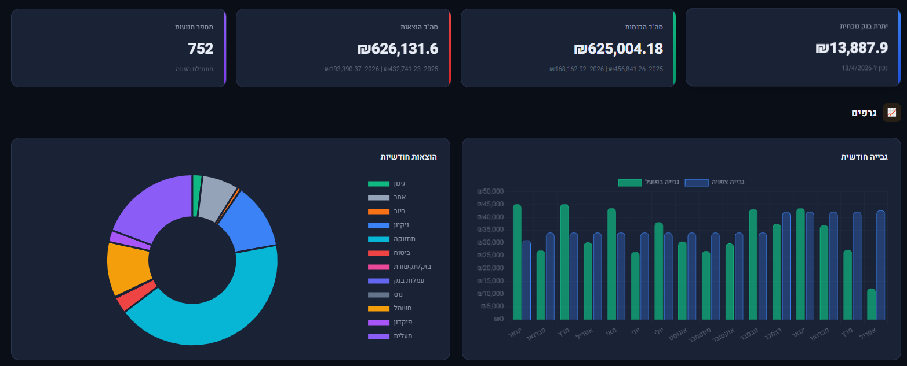
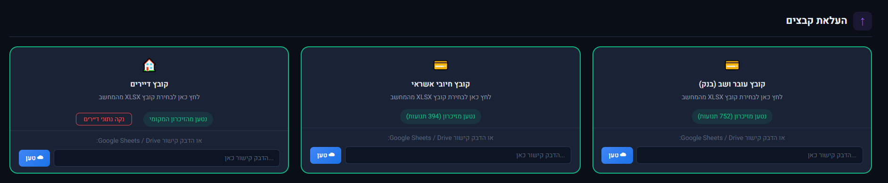
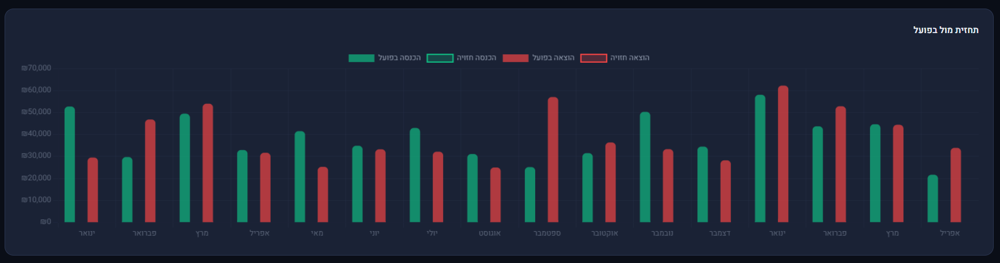
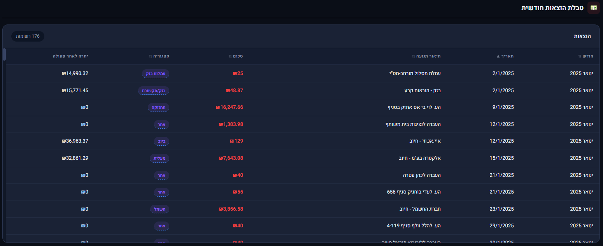

# VB — Building Manager

<p align="center">
  
</p>

**Smart HOA (building committee) management system — financial dashboard, tenant tracking, expense management, and forecasting in a single HTML file**

VB replaces spreadsheet-based building management with an interactive dashboard. Import bank statements and tenant data, and the system automatically classifies transactions, tracks payments per apartment, calculates debts, and generates financial reports with charts and forecasts.

---

## Live Demo

🔗 [View Live App](https://amitrubin10.github.io/vb-building-manager/)

---

## Features

### Data Import
- Import bank statements (Excel/CSV) with automatic column detection and mapping
- Import credit card statements
- Import tenant/apartment files
- Direct import from Google Sheets / Google Drive via URL
- Smart column recognition with manual override option

### Financial Dashboard
- Real-time KPI cards: current bank balance, total income, total expenses, transaction count
- Year-over-year breakdown (current year vs. previous year)
- Monthly collection chart: expected vs. actual payments
- Expense breakdown by category (donut chart): maintenance, cleaning, elevator, insurance, electricity, gardening, sewage, and more
- Forecast vs. actual comparison chart

### Tenant & Payment Management
- Per-apartment tracking: monthly HOA fee, total due, amount paid, outstanding debt
- Payment status indicators: paid in full, partial payment, unpaid, overpaid
- Payment method tracking (bank transfer, etc.)
- 70+ apartment support with sortable columns
- Drill-down view per apartment for detailed history

### Expense Management
- Categorized expense table with automatic classification
- Running balance after each transaction
- Sortable by date, amount, category
- Category-based filtering

### Forecasting
- Monthly income and expense forecasting
- Visual comparison of forecast vs. actual performance
- Configurable projections per month

### Settings & Configuration
- Customizable apartment types and pricing tiers
- Apartment-to-type assignment
- Building name customization
- Full backup and restore (export/import settings as JSON)

### Filtering & Reports
- Filter by date range, specific month, apartment, payment status, expense category
- All views update dynamically based on active filters

---

## Tech Stack

| Component | Technology |
|-----------|-----------|
| Frontend | HTML5, CSS3, Vanilla JavaScript |
| Charts | Chart.js |
| Excel Parsing | SheetJS (xlsx.js) |
| Cloud Import | Google Sheets / Drive integration |
| Data Storage | Browser localStorage (no server required) |
| Design | Dark theme, RTL Hebrew, responsive layout |
| Architecture | Single self-contained HTML file (~3,600 lines) |

---

## Screenshots

<p align="center">
  
</p>
<p align="center">
  
</p>
<p align="center">
  
</p>
<p align="center">
  
</p>
<p align="center">
  
</p>

---

## How It Works

```
Bank Statement (xlsx)     Credit Card (xlsx)     Tenant File (xlsx)
       │                        │                       │
       ▼                        ▼                       ▼
┌──────────────────────────────────────────────────────────┐
│              Smart Column Detection & Mapping            │
└──────────────────────────┬───────────────────────────────┘
                           │
                           ▼
┌──────────────────────────────────────────────────────────┐
│            Transaction Classification Engine             │
│  ┌─────────┐ ┌──────────┐ ┌───────────┐ ┌────────────┐  │
│  │ Income  │ │ Expenses │ │  Category │ │  Apartment  │  │
│  │ Detect  │ │  Detect  │ │  Assign   │ │   Match     │  │
│  └─────────┘ └──────────┘ └───────────┘ └────────────┘  │
└──────────────────────────┬───────────────────────────────┘
                           │
                           ▼
┌──────────────────────────────────────────────────────────┐
│                   Interactive Dashboard                   │
│  ┌──────┐ ┌────────┐ ┌──────────┐ ┌──────────────────┐  │
│  │ KPIs │ │ Charts │ │ Forecast │ │ Tenant & Expense │  │
│  │      │ │        │ │          │ │     Tables        │  │
│  └──────┘ └────────┘ └──────────┘ └──────────────────┘  │
└──────────────────────────────────────────────────────────┘
```

---

## Installation

No installation needed. VB runs entirely in the browser.

1. Open the app URL or the HTML file locally
2. Upload your bank statement (Excel format)
3. Optionally upload tenant and credit card files
4. The dashboard generates automatically

All data stays in your browser. Nothing is sent to any server.

---

## Status

In active production use for real building management.

---

## Author

**Amit Rubin**
ERP & AI Operations Lead | QA, Automation & Product at Hashavshevet (Wizsoft)
